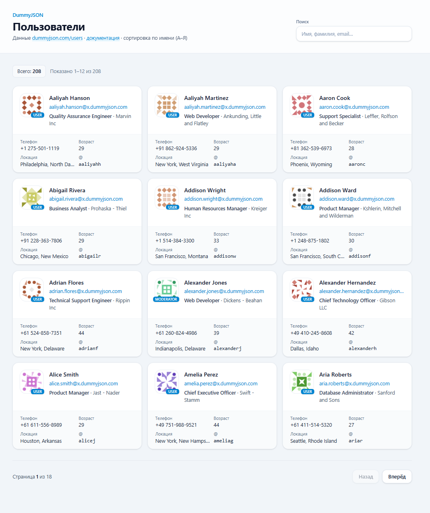

# Дашборд пользователей (DummyJSON)

Клиент на **React 19**, **TypeScript**, **Vite 8**, **Redux Toolkit** и **RTK Query** для загрузки и отображения пользователей с публичного API [DummyJSON](https://dummyjson.com/). Стили — **Tailwind CSS 4**. В браузере **нет** полной копии каталога пользователей: список, поиск, сортировка и пагинация выполняются **на стороне сервера DummyJSON** по HTTP-параметрам запроса.

## Скриншот



---

## Клонирование репозитория

```bash
git clone https://github.com/MrKamura/test_users_dashboard.git
cd test_users_dashboard
```

Дальше — установка зависимостей и запуск (см. ниже).  
По SSH, если у вас [настроен ключ](https://docs.github.com/en/authentication/connecting-to-github-with-ssh):

```bash
git clone git@github.com:MrKamura/test_users_dashboard.git
cd test_users_dashboard
```

---

## Требования

- **Node.js** 20+ (рекомендуется LTS)
- **npm** (или совместимый менеджер пакетов)

---

## Установка и запуск

```bash
# зависимости
npm install

# режим разработки (Vite dev server, HMR)
npm run dev
```

Открой в браузере адрес из консоли (обычно `http://localhost:5173`).

### Сборка продакшена

```bash
npm run build
npm run preview   # локальный просмотр каталога dist
```

### Проверки качества кода

```bash
npm run lint          # ESLint
npm run lint:fix      # ESLint с автоисправлением
npm run format        # Prettier — форматирование
npm run format:check  # проверка стиля без записи
npm run check         # format:check + lint
```

---

## Зачем так сделано (кратко)

| Технология                            | Роль в проекте                                                                                                                                               |
| ------------------------------------- | ------------------------------------------------------------------------------------------------------------------------------------------------------------ |
| **RTK Query**                         | Один слой для «асинхронного сервера»: кэш запросов, дедупликация, статусы `loading` / `fetching` / `error`, хуки `useGetUsersQuery` / `useSearchUsersQuery`. |
| **Два эндпоинта в `usersApi`**        | Разделение «полный список с сортировкой» и «поиск по строке» — как в [документации DummyJSON Users](https://dummyjson.com/docs/users).                       |
| **`useUsersList`**                    | Номер страницы + выбор запроса; `skip = page * USERS_PAGE_SIZE` уходит вместе с `limit` на DummyJSON.                                                        |
| **`key={debouncedSearch}` на списке** | При смене поиска компонент списка монтируется заново — страница пагинации сбрасывается без `useEffect`.                                                      |
| **`useDeferredValue` + поиск**        | Строка поиска «догоняет» ввод, чтобы не спамить API на каждую букву.                                                                                         |

**Структура `src/`** — в духе типичного тестового: `api/`, `components/`, `hooks/`, `types/`, `store.ts`, `constants.ts`, алиас импорта `@/` → `src/`.

---

## Асинхронные запросы: как это работает

1. **Транспорт** — `fetchBaseQuery` из RTK Query с `baseUrl: https://dummyjson.com/`. Запросы идут обычным `fetch` по HTTPS.

2. **Хуки** — `useGetUsersQuery` и `useSearchUsersQuery` подписываются на срез стора `usersApi`. Пока ответ не пришёл, срабатывает **`isLoading`** (первая загрузка по этому ключу). При смене страницы или фоновом обновлении — **`isFetching`**, при ошибке — **`isError`** и объект **`error`**.

3. **Кэш** — ключ запроса строится из URL и аргументов (`limit`, `skip`, `sortBy`, `q`, …). Повторный заход на ту же «страницу» может отдать данные из кэша (см. настройки RTK Query по умолчанию).

4. **Опция `skip` в хуках** — не путать с пагинацией: в коде `{ skip: isSearch }` для `getUsers` означает «**не выполнять** этот запрос», пока активен режим поиска, и наоборот для `searchUsers`. В один момент времени реально выполняется **один** из двух запросов.

Итог: вся «асинхронность» списка — это **HTTP-запросы к DummyJSON** и реакция UI на статусы RTK Query; отдельного самописного `useEffect` с `fetch` для списка нет.

---

## Поиск и «фильтрация»

В приложении реализованы:

- **Поиск по строке** — эндпоинт DummyJSON `GET /users/search?q=...` (см. [Users — Search](https://dummyjson.com/docs/users)). На **их** стороне выполняется подбор пользователей по запросу; клиент передаёт только `q`, `limit` и `skip`.

**Отдельные фильтры** вида «по полю / значению» (`/users/filter?key=...&value=...` в документации DummyJSON) **в UI не подключены** — при необходимости их можно добавить вторым эндпоинтом в `usersApi` по той же схеме.

**Клиентская фильтрация** по уже загруженным данным **не используется** для всего каталога: в память не подгружаются все ~200+ пользователей — только текущая «страница» ответа.

---

## Пагинация

- Размер страницы — **`USERS_PAGE_SIZE`** в `src/constants.ts`.
- На сервер уходят параметры:
  - **`limit`** — сколько записей в ответе;
  - **`skip`** — сколько записей пропустить с начала выборки.

Формула в клиенте: `skip = page * USERS_PAGE_SIZE`, где `page` — ноль-based индекс страницы.

Ответ DummyJSON всегда включает метаданные: **`total`** (всего записей в выборке), **`skip`**, **`limit`**, массив **`users`**. По `total` и `limit` на клиенте считается число страниц для кнопок «Назад» / «Вперёд».

---

## Что делает сервер DummyJSON (сводка)

- отдаёт **порцию** данных по `limit` и `skip` (пагинация);
- для `GET /users` может применять **`sortBy`** и **`order`** — сортировка на стороне API;
- для `GET /users/search` выполняет **поиск по `q`** и возвращает уже отфильтрованную выборку (также с `total`, `skip`, `limit`).

Точное поведение и дополнительные параметры описаны в официальной документации: [Users - DummyJSON](https://dummyjson.com/docs/users).

---

## Переменные окружения

Проект использует фиксированный `baseUrl` в `usersApi`. Для другого бэкенда имеет смысл вынести URL в `import.meta.env` и подставлять в `fetchBaseQuery`.
